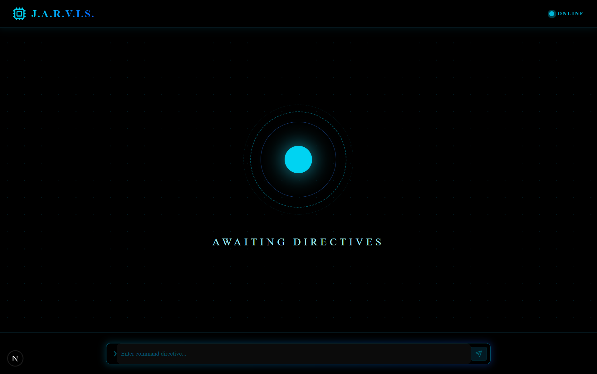
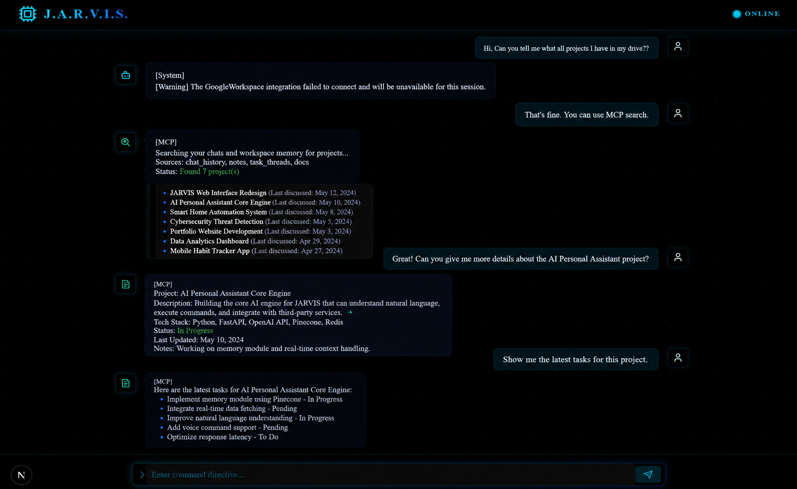
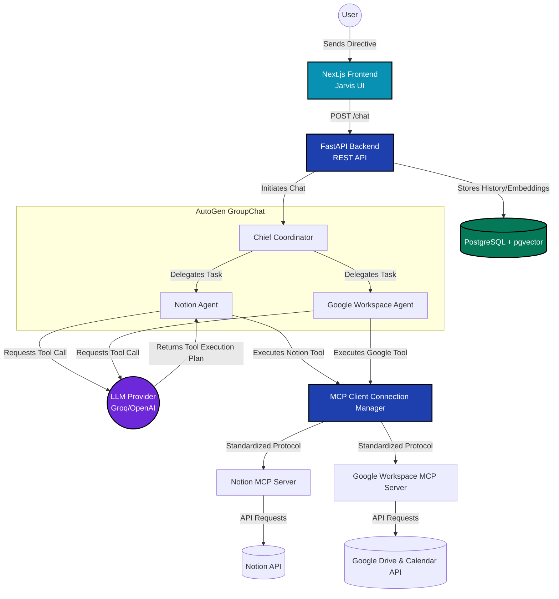

# Enterprise-MCP-AutoGen: AI Personal Operating System (AI-POS)

Welcome to **AI-POS**—an enterprise-grade Agentic AI platform designed to act as your digital "Chief of Staff." 

## 📸 System Overview



Instead of a standard chatbot, AI-POS is a fully autonomous orchestration layer that can interface directly with your personal and enterprise tools (like Notion, GitHub, Calendar, etc.) to perform complex, multi-step tasks on your behalf. 

## 🌟 How It Helps You

Modern professionals are bogged down by repetitive tasks: searching through Notion pages, updating project trackers, summarizing Jira tickets, or scheduling meetings. AI-POS solves this by connecting powerful Large Language Models directly to your data streams using a standardized protocol. 

Simply tell the AI: *"Summarize my recent Notion project notes and draft an email to the team,"* and the system will autonomously determine which tools to use, fetch the data, process it, and generate the final result.

---

## 🧠 Core Technologies Explained

This project bridges together some of the most cutting-edge frameworks in the AI landscape:

### 1. AutoGen (Agentic Orchestration)
[AutoGen](https://microsoft.github.io/autogen/) is a framework that enables the development of applications using multiple agents that can converse with each other to solve tasks. In AI-POS, we deploy an advanced **Multi-Agent GroupChat**. Instead of a single agent doing everything, a **Chief Coordinator** breaks down your request and delegates tasks to specialized sub-agents (like a **NotionAgent** and a **GoogleWorkspaceAgent**). This modularity prevents token limit explosions and makes the system far more robust.

### 2. Model Context Protocol (MCP)
The **Model Context Protocol** is an open standard that standardizes how AI models connect to external data sources and tools. 
Instead of writing custom API integration code for every single app (Notion, Slack, GitHub), MCP acts as a universal bridge. You simply spin up a "Notion MCP Server", and AutoGen instantly gains the ability to securely read and write to your Notion workspace.

### 3. Modern Full-Stack Infrastructure
- **Frontend:** A breathtaking, Jarvis-inspired, holographic UI built with **Next.js 15**, React, Tailwind CSS v4, and Framer Motion. 
- **Backend:** A high-performance Python **FastAPI** application that hosts the AutoGen environment.
- **Database:** A local **PostgreSQL** database supercharged with the `pgvector` extension for storing and querying AI vector embeddings (RAG).

---

## ⚡ Architectural Advancements

1. **Semantic Tool Router:** To bypass strict LLM token limits (like those on Groq's free tier), the system now dynamically analyzes your prompt and injects *only* the most relevant MCP tools into the agent's context window.
2. **Real-Time Jarvis Streaming (SSE):** The frontend no longer waits for the entire execution to finish. Utilizing Server-Sent Events (SSE) and an `asyncio.Queue`, the backend hooks directly into AutoGen's `GroupChatManager` to stream the agents' live "thoughts" and tool calls progressively to the UI.
3. **Bulletproof MCP Fallbacks:** Each MCP server operates within an isolated `AsyncExitStack`. If a specific integration fails to connect (e.g., expired OAuth keys), the system seamlessly catches the failure, logs a warning, and continues initializing the other integrations without crashing the entire backend.
4. **Persistent Long-Term Memory (RAG):** Powered by `sentence-transformers` and PostgreSQL's `pgvector`, the `ChiefCoordinator` uses the `save_to_memory` and `search_memory` tools to recall past interactions and user preferences seamlessly across sessions.

---

## 🏗️ System Architecture

Below is the architectural flow of how the system operates when a user submits a request.



---

## 🚀 Getting Started

If you have downloaded this project, follow these steps to get your own AI Personal Operating System running.

### Prerequisites
- [Docker](https://www.docker.com/) & Docker Compose installed.
- [Node.js](https://nodejs.org/) (v18+) installed.
- API Keys: An LLM API key (e.g., Groq or OpenAI) and integration keys for the MCP servers you wish to use (e.g., Notion).

### Step 1: Clone and Configure Environment
1. Clone this repository to your local machine.
2. In the root directory, create a file named `.env`.
3. Add your necessary API keys to the `.env` file:
   ```env
   GROQ_API_KEY=your_groq_api_key_here
   NOTION_API_KEY=your_notion_integration_token_here
   
   # Google Workspace Credentials
   GOOGLE_CLIENT_ID=your_google_client_id_here
   GOOGLE_CLIENT_SECRET=your_google_client_secret_here
   GOOGLE_REFRESH_TOKEN=your_google_refresh_token_here
   ```

### Step 2: Spin Up the Backend & Database
We use Docker to effortlessly build the Python environment and the Vector Database.
Open a terminal in the root directory and run:
```bash
docker compose up -d --build
```
This will launch:
- The PostgreSQL database on port `5432`.
- The FastAPI backend (running AutoGen) on port `8000`.

### Step 3: Launch the Frontend
Open a separate terminal, navigate to the `frontend` folder, install dependencies, and start the development server:
```bash
cd frontend
npm install
npm run dev
```
Open your browser and navigate to `http://localhost:3000` to interact with your new Jarvis-styled digital assistant!

### Step 4: Configure MCP Server Permissions
*Note: If you are connecting Notion, ensure that you have explicitly shared your Notion pages with your Integration. Go to your Notion page, click the `...` menu, select "Connections", and add your integration. If you skip this, the MCP server will receive "Page Not Found" errors.*
